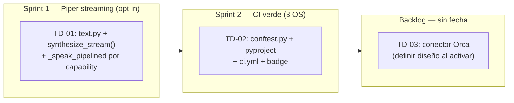

# PRD — Deuda Técnica `agent-tts` (v2, post-auditoría)

> **Repositorio:** [`chiptime/agent-tts`](https://github.com/chiptime/agent-tts) · local: `~/Code/personal/agent-tts`  
> **Revisión:** Septiembre 2026 · **Estado al inicio:** v0.1.0  
> **Procedencia:** Reemplaza al PRD generado por agente externo (Antigravity). Corregido tras auditoría línea a línea contra el código real. Decisiones de dueño registradas: **TD-01 opt-in**, **TD-02 aprobado tal cual**, **TD-03 redefinido como conector Orca y dejado en backlog**.

---

## Contexto General

`agent-tts` es un motor de TTS standalone para coding agents en terminal. La implementación principal está completa: motor nativo C (`miniaudio`), IPC bidireccional por socket Unix/TCP, streaming pipelined por grupos de frases, Kokoro-82M ONNX offline (opcional vía extra `[kokoro]`), redactor de secretos y Agent Connectors (`sources/`).

Este PRD cubre únicamente la deuda técnica aceptada. Todo se implementa bajo el **principio clean-room**: diseño nativo propio sin reutilizar código de terceros.

### Correcciones respecto al PRD original (auditoría verificada)

| Claim del PRD original | Realidad verificada en el código |
|---|---|
| "audio.py itera `synthesize_stream()` según `supports_stream`" | **Falso.** El despacho vive en `cli.py` (`use_pipelined_stream`, lista `STREAM_AUTO_PROVIDERS` + umbral de 400 chars). `audio.py` no participa en el despacho de streaming. |
| "edge/openai/elevenlabs implementan `synthesize_stream()`" | Solo `openai` y `elevenlabs` (lo usan internamente dentro de `synthesize()`). `edge` usa group pipelining con `synthesize()` por grupo. |
| "`BoundaryMap` estima duraciones desde bytes PCM" | Las estimaciones actuales son por conteo de caracteres (`estimate_boundaries_from_text`). |
| "3 ítems pendientes en el roadmap del README" | Son 4 (el cuarto, "Incremental MP3 Frame-Accurate Byte Streaming", queda fuera de este PRD). |
| TD-03: silenciar Orca vía D-Bus (`pauseSpeech`/`resumeSpeech`) | **API inexistente.** `org.gnome.Orca` no expone esos métodos; Orca delega el habla en Speech Dispatcher. Requisito real del dueño: un conector (ver TD-03). |

### Decisiones de dueño (registradas)

1. **TD-01:** el streaming de Piper es **opt-in** — por defecto no se usa; solo mediante `--stream on` explícito. Nunca entra en `auto`.
2. **TD-02:** se aprueba el diseño tal cual.
3. **TD-03:** se redefine como **conector Orca** (patrón `sources/`) y se deja **planificado en el roadmap para más adelante**, sin diseño en este PRD.

---

## TD-01 — Piper Sentence-Group Streaming con Proceso Persistente (opt-in)

### Problema (verificado)

- `PiperTTSProvider` (`src/agent_tts/providers/piper.py`) no define `synthesize_stream()`; hereda `supports_stream = False` de `base.py`.
- `synthesize()` lanza **un proceso piper por llamada** (`await proc.communicate(input=text.encode("utf-8"))`), lo que implica una carga de modelo por invocación.
- Hoy `--stream on` ya activa el camino pipelined con **cualquier** provider (`use_pipelined_stream`, `cli.py:220-221`), y ese camino llama `engine.synthesize()` **por grupo de frases** (`_speak_pipelined`, productor en `cli.py:378-416`). Con piper, eso significa **un spawn + carga de modelo por grupo**: la latencia entre grupos no baja nunca.
- `cli.py:200-222` despacha `auto` por **lista de nombres** (`STREAM_AUTO_PROVIDERS`) y no por capability: `supports_stream` y `synthesize_stream()` son, a día de hoy, código muerto a nivel de orquestación.

**Decisión de producto:** Piper **no** entra en `auto` (una línea en `STREAM_AUTO_PROVIDERS` sería lo mínimo, pero se rechaza: el dueño quiere opt-in explícito). El valor de TD-01 es que `--stream on` con piper pase de "N procesos" a "1 proceso persistente".

### Diseño de Solución (clean-room)

Piper CLI acepta líneas en stdin y emite un WAV completo por línea en stdout, secuencialmente. Estrategia:

1. **Extraer `split_sentence_groups()`** de `cli.py` a un módulo compartido (p. ej. `src/agent_tts/text.py`) y re-importarlo en `cli.py`. Sin cambio de comportamiento. Una sola fuente de verdad para el splitting (provider y orquestación deben usar la misma función para que los chunks y los grupos correspondan 1:1).
2. **Implementar `PiperTTSProvider.synthesize_stream()`** (generador síncrono, contrato exacto de `base.py`):
   - **Un solo proceso piper persistente** por sesión de síntesis: `stdin`/`stdout` en modo pipe, **sin `communicate()`**.
   - Escribe cada grupo como una línea en `stdin`; de `stdout` lee **un WAV completo por línea**: parsear la cabecera RIFF y leer exactamente `data_size` bytes antes de pasar al siguiente.
   - Emite cada WAV completo como una iteración del generador.
   - `stop_checker` se consulta entre líneas: si dispara, `terminate()` al proceso y fin del generador sin chunks huérfanos.
   - Cierre ordenado en `finally`: `stdin.close()` → `wait()`.
   - `supports_stream = True`.
3. **`_speak_pipelined` consume la capability**: si `engine.supports_stream`, el productor consume `synthesize_stream()` **una sola vez** (generador síncrono corrido en el event loop privado del productor, como hoy) en lugar de N llamadas a `synthesize_group()`. Cada chunk se asocia a su grupo re-dividiendo el texto con la **misma función compartida** (mismo orden garantizado) para alimentar `merge_group` / BoundaryMap. Si el número de chunks no coincide con los grupos: warning a stderr y boundaries degradados — nunca crash.
4. **Despacho sin cambio de producto**: `auto` mantiene su lista actual (piper fuera); `on` ya es universal. Así `supports_stream` pasa a estar vivo en orquestación sin alterar el comportamiento por defecto de nadie.
5. **openai/elevenlabs quedan como están** (su `synthesize_stream` interno sigue funcionando). Migrarlos al consumo explícito de orquestación es un follow-up fuera de este PRD. `edge` sigue con `synthesize()` por grupo.

### Criterios de Aceptación

- [ ] `PiperTTSProvider.supports_stream` es `True` y `synthesize_stream()` sigue el contrato de `base.py` (generador síncrono de `bytes`)
- [ ] El primer chunk WAV llega en ≤ la latencia del primer grupo actual (sin regresión de first-audio)
- [ ] Con N grupos se genera **exactamente 1 proceso piper** (test con `Popen` mockeado asserta un solo spawn)
- [ ] `--stream on --provider piper` reproduce todos los grupos en orden; la suma de PCM decodificado equivale a la de N × `synthesize()` para el mismo texto
- [ ] `stop_checker` entre líneas termina el proceso limpiamente (sin proceso huérfano, sin chunks sobrantes)
- [ ] Piper binario ausente → mismo error explícito que hoy en `synthesize()` (no silencioso)
- [ ] `--stream auto --provider piper` con texto largo → **single-shot** (regresión: piper nunca auto-streaming)
- [ ] Desajuste chunks/grupos → warning a stderr, reproducción continúa, sin excepción
- [ ] Tests nuevos en `tests/test_stream_piper.py`: stream completo, un solo spawn, interrupción, binario ausente, auto queda en single-shot

### Archivos Afectados

| Archivo | Cambio |
|---|---|
| `src/agent_tts/providers/piper.py` | `supports_stream = True` + `synthesize_stream()` con proceso persistente |
| `src/agent_tts/cli.py` | `_speak_pipelined` consume `synthesize_stream()` cuando `engine.supports_stream`; re-importar splitter compartido |
| `src/agent_tts/text.py` | Crear — `split_sentence_groups()` extraída de `cli.py` (fuente única) |
| `tests/test_stream_piper.py` | Tests nuevos |
| `README.md` | Tabla de providers: Piper de `➖` a `✅` con nota "`--stream on` only, nunca `auto`" |

---

## TD-02 — CI en Windows (GitHub Actions Matrix) — aprobado

### Problema (verificado)

El stack Windows (WASAPI vía `miniaudio`, `winhost` TCP server, transporte `wsl-ps` vía PowerShell, IPC sobre TCP loopback) existe y funciona, pero solo está validado en local:

- **No existe `.github/`** — cero CI de ningún tipo.
- Los tests de `test_winhost.py`, `test_ipc_transport.py`, `test_wav.py`, `test_powershell_playback.py` y `test_playback_target.py` existen y pasan en local, pero no se ejecutan en CI para ninguna plataforma.
- Un PR que rompa el transporte TCP IPC en Windows pasaría desapercibido.
- **No existe `tests/conftest.py`** (los fakes están duplicados por archivo) ni `[tool.pytest.ini_options]` en `pyproject.toml`; `dev` extras solo contiene `pytest` (sin `ruff`).

### Diseño de Solución

GitHub Actions con `strategy.matrix` de tres plataformas (`ubuntu-latest`, `macos-latest`, `windows-latest`).

#### Pipeline Principal (`ci.yml`)

```
Trigger: push a main, PR a main

Jobs:
  test (matrix: ubuntu / macos / windows):
    - Checkout
    - Setup Python 3.11
    - pip install -e ".[dev]"
    - pytest tests/ -v --tb=short
      con markers: skip @pytest.mark.needs_audio en CI (sin dispositivo de audio real)
      con markers: skip @pytest.mark.needs_powershell en ubuntu/macos

  lint:
    - ubuntu-latest only
    - ruff check src/ tests/
    - ruff format --check src/ tests/
```

#### Separación de Tests por Plataforma

`conftest.py` nuevo en `tests/`:

```python
import sys
import pytest

def pytest_configure(config):
    config.addinivalue_line("markers", "needs_audio: test requires real audio playback device")
    config.addinivalue_line("markers", "needs_powershell: test requires powershell.exe")
    config.addinivalue_line("markers", "windows_only: test only runs on Windows")

def pytest_runtest_setup(item):
    if "needs_powershell" in item.keywords and sys.platform != "win32":
        pytest.skip("requires powershell.exe (Windows only)")
    if "windows_only" in item.keywords and sys.platform != "win32":
        pytest.skip("Windows-only test")
```

`pyproject.toml`:

```toml
[tool.pytest.ini_options]
addopts = "-ra --tb=short"
testpaths = ["tests"]
markers = [
    "needs_audio: requires real audio playback device",
    "needs_powershell: requires powershell.exe on Windows",
    "windows_only: only runs on Windows platform",
]
```

Y `"ruff"` añadido al extra `dev`.

#### Cobertura real de los tests existentes (verificada, sin hardware)

| Test | Mecanismo real | Requiere hardware |
|---|---|---|
| `test_winhost.py` | `FakeDevice` + loopback TCP con puertos efímeros | No |
| `test_ipc_transport.py` | `AudioSession` real + servidor echo sobre AF_UNIX / TCP loopback | No |
| `test_wav.py` | `struct` puro sobre cabeceras WAV | No |
| `test_powershell_playback.py` | `FakePopen` (sesión PowerShell persistente) | No |
| `test_playback_target.py` | Monkeypatch de `shutil.which` / `sys.platform` | No |

> Nota honesta (corrige al PRD original): solo `test_winhost.py` usa `FakeDevice` + TCP; los demás usan otros mecanismos, pero ninguno requiere hardware de audio → los cinco son CI-ables en los tres OS.

### Criterios de Aceptación

- [ ] GitHub Actions ejecuta tests en `ubuntu-latest`, `macos-latest`, `windows-latest` en cada push/PR a `main`
- [ ] `test_winhost.py`, `test_ipc_transport.py` y `test_wav.py` pasan en los tres OS
- [ ] `test_powershell_playback.py` pasa en Windows; saltado automáticamente en Linux/macOS
- [ ] El job de lint (`ruff`) pasa en `ubuntu-latest`
- [ ] Badge de CI añadido al `README.md` (URLs de `chiptime/agent-tts`)
- [ ] Ningún test de CI requiere audio real

### Archivos a Crear/Modificar

| Archivo | Acción |
|---|---|
| `.github/workflows/ci.yml` | Crear — matrix ubuntu/macos/windows |
| `tests/conftest.py` | Crear — markers de plataforma |
| `pyproject.toml` | Añadir `[tool.pytest.ini_options]` + `ruff` en `[dev]` |
| `README.md` | Añadir badge de CI |

---

## TD-03 — Conector Orca (backlog — sin diseño en este PRD)

### Decisión del dueño

El ítem **no** es "silenciar Orca durante la reproducción" (diseño del PRD original, descartado: se basaba en una API D-Bus inexistente y planteaba mal el problema). El requisito real, ya registrado:

> Montar **otro Agent Connector** siguiendo el patrón de `sources/` (Vision B), pero cuyo consumidor es **Orca** en lugar de herdr-tts: exponer la salida de `agent-tts` al ecosistema de accesibilidad AT-SPI2/Orca (texto para verbalización/braille de Orca), opt-in, solo Linux/GNOME.

### Estado

- **Planificado en el roadmap para más adelante.** Sin diseño, sin estimación, sin criterios de aceptación en esta versión del PRD.
- El bullet correspondiente del README queda como está hasta su activación.

### Preguntas abiertas a resolver al activarlo

1. Superficie de emisión: eventos AT-SPI2 nativos vs. entrega de texto por el canal que Orca ya consume.
2. Convivencia con el audio local: ¿el conector sustituye la síntesis local para ese cliente, o coexiste?
3. Propiedad de voz/velocidad: ¿las respeta Orca (voz del usuario) o hay negociación?
4. Semántica de host: cómo encaja con el patrón herdr-tts como host thin.

---

## Roadmap y Secuencia Recomendada



### Estimaciones

| ID | Complejidad | Estimación |
|---|---|---|
| TD-01 Piper streaming persistente | Media | 1 día (código) + 0.5 día (tests) + 0.5 día (refactor dispatch) |
| TD-02 CI infrastructure | Baja–Media | 0.5 día (conftest/pyproject) + 1 día (ci.yml debug en 3 OS) |
| TD-03 Conector Orca | — | n/d (backlog) |
| **Total en alcance** | | **~3 días** |

### Condición de Cierre del PRD

1. TD-01: tests verdes y fila Piper del README en `✅` con nota "`--stream on` only, nunca `auto`"
2. TD-02: badge de CI verde en los tres sistemas operativos
3. TD-03: registrado en el roadmap (sin código)

---

## Apéndice — Estado de Partida Verificado

### Interfaz de streaming (`base.py:42-50`, generador síncrono)

```python
def synthesize_stream(
    self,
    text: str,
    voice: str,
    rate: str = "+0%",
    volume: str = "+0%",
    pitch: str = "+0Hz",
    stop_checker: Optional[Callable[[], bool]] = None,
) -> Iterator[bytes]:
    """Yields MP3/WAV chunks incrementally. Only for supports_stream=True providers."""
    raise NotImplementedError
```

`supports_stream: bool = False` por defecto (`base.py:28`).

### Providers — estado real del streaming

| Provider | `supports_stream` | `synthesize_stream()` | Uso real |
|---|---|---|---|
| `edge` | `False` | No | Group pipelining con `synthesize()` |
| `openai` | `True` | Sí | Interno dentro de `synthesize()` (chunked HTTP, `stream: true`) |
| `elevenlabs` | `True` | Sí | Interno dentro de `synthesize()` (endpoint `/stream`) |
| `piper` | `False` (heredado) | No | `synthesize()` — un proceso piper por llamada |
| `kokoro` | `False` | No | ONNX offline, extra `[kokoro]` opcional |

### Despacho actual (`cli.py`)

- `STREAM_AUTO_PROVIDERS = ("edge", "openai", "elevenlabs", "eleven")` — `cli.py:200`
- `STREAM_AUTO_MIN_CHARS = 400` — `cli.py:201`
- `use_pipelined_stream()`: `--stream on` → `True` para cualquier provider; `auto` → lista + umbral — `cli.py:209-222`
- `split_sentence_groups(text, max_chars=250)` — `cli.py:225`
- `_speak_pipelined`: productor que llama `engine.synthesize()` por grupo y alimenta `AudioSession.append_pcm` — `cli.py:370-423`

### Tests existentes (todos hardware-free, sin CI)

`test_winhost.py` (FakeDevice + TCP), `test_ipc_transport.py` (AF_UNIX vs TCP), `test_wav.py` (struct), `test_powershell_playback.py` (FakePopen), `test_playback_target.py` (monkeypatch). Sin `conftest.py`; fakes duplicados por archivo.

### Ausencias confirmadas

`.github/` (cero CI), `tests/conftest.py`, `[tool.pytest.ini_options]`, `ruff` en dev extras, `src/agent_tts/orca.py`, flag `--orca` / `AGENT_TTS_ORCA`.
