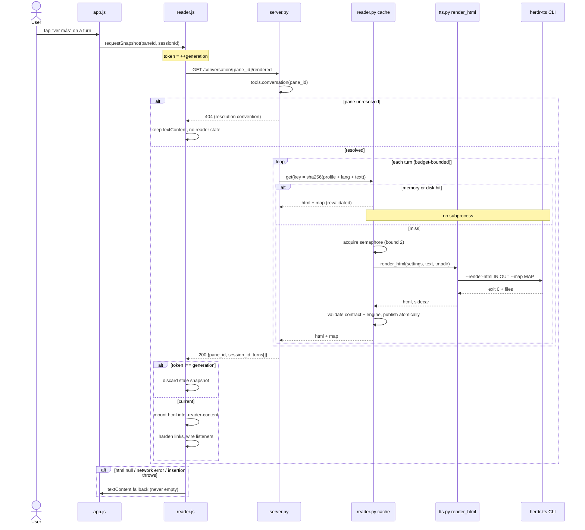

# Design: Formatted Conversation Reader

## Context

`#glance-turns` renders every conversation turn with `textContent` (`app.js:886`). `innerHTML` appears **0 times** in the entire PWA client. This change introduces the first HTML-insertion boundary in the product, backed by the upstream `reader-pipeline/anchors@1` contract, without adding a browser Markdown parser and without touching speech.

Authoritative inputs: `specs/conversation-reader/spec.md` (14 requirements / 45 scenarios), `proposal.md` (pinned API), `exploration.md` (evidence), and the read-only upstream `reader-pipeline-contract.md`.

### Goals

- Serve per-turn anchored HTML plus the complete sidecar inline from one endpoint.
- Never spawn a renderer subprocess for content already rendered.
- Degrade to plain text on every failure class, always HTTP 200 for a resolved pane.
- Keep speech and text answers bit-for-bit unaffected.
- Ship under the 400-line review budget as independently green slices.

### Non-Goals

Audio synchronization, timing estimation, player IPC, Markdown editing, a full-screen reader, new runtime/dev dependencies, upstream changes.

### Codebase constraints discovered (these drive the decisions below)

| Evidence | Location | Consequence |
|---|---|---|
| No `package.json`, no `node_modules`, no jsdom | repo root | `reader.js` cannot use global `document` |
| `approval.js` is pure logic, injected collaborators | `approval.js:405-412` | UMD + injection is the established client pattern |
| Inline `<style>` block, 2 `style="..."` attrs | `index.html:10,1113,1114` | CSP needs `style-src 'unsafe-inline'` (pinned set has it) |
| 4 external same-origin scripts, no inline `<script>` | `index.html:1121-1124` | `script-src 'self'` is safe |
| No `eval` / `new Function` / `WebAssembly` / `createObjectURL` / `Worker` | all of `static/*.js` | no `'unsafe-eval'`, no `worker-src` needed |
| All `fetch()` targets are relative, same-origin | `app.js:549,1040,1053,1069,2221` | `connect-src 'self'` is safe |
| `renderGlance` is a keyed reconciler on `role \u0000 text` | `app.js:959` | reader reuses the same content key |
| `glanceNeedsWipe = true` on pane switch | `app.js:754` | exact, pre-existing snapshot-reset point |
| `render_mp3` takes a `runner` seam; `create_app` takes `tts_renderer` | `tts.py:107`, `server.py:174` | two-layer injection precedent to mirror |
| `Settings` is a frozen dataclass, all fields non-default | `config.py:59-87` | new fields **must** carry defaults |

## Architecture Overview

```
  app.js  ──(user expands a turn)──►  reader.js  ──GET /conversation/{pane}/rendered──►  server.py
    │                                    │                                                  │
    │  injected doc + http               │  generation token                        reader.py (cache)
    │  .reader-content mount             │  scoped selection                            │        │
    ▼                                    ▼                                        memory LRU   disk
  #glance-turns .gturn               [data-sent-idx] selection                      (128)   reader_cache/
                                                                                          │
                                                                                     tts.py render_html
                                                                                          │
                                                                          herdr-tts --render-html (transient)
```

Three new units, one per concern: `tts.py::render_html` owns the CLI boundary, `reader.py` owns cache + orchestration, `reader.js` owns presentation. `server.py` only wires and shapes HTTP.

### Sequence



## Architecture Decisions

### Decision 1: `reader.js` receives its DOM surface by injection; it never references a global

**Choice**: `createReader({ doc, http })` returns an instance. Every DOM touch goes through `doc` or through element handles passed in. `reader.js` contains **zero** occurrences of the identifier `document`.

**Alternatives considered**: (a) add `jsdom` as a dev dependency; (b) test `reader.js` only through Python/Playwright; (c) leave DOM code in `app.js` and test nothing.

**Rationale**: The spec makes the Node suite release-blocking for mounting, fallback, selection and link hardening — all DOM behaviors — while simultaneously forbidding new dependencies. The repo has no `package.json` at all, so `jsdom` is not merely undesirable, it is unavailable. `approval.js` already proves the house pattern: pure module, injected collaborators, `require()`d straight from `tests/js/`. Injection is the only option that satisfies both constraints, and it matches existing convention instead of inventing one. (c) would silently drop a release-blocking requirement.

**Enforced DOM surface contract** — `reader.js` may use only:

`doc.createElement`, `doc.createTextNode`, `el.appendChild`, `el.removeChild`, `el.replaceChild`, `el.querySelector`, `el.querySelectorAll`, `el.setAttribute`, `el.getAttribute`, `el.removeAttribute`, `el.classList.{add,remove,toggle,contains}`, `el.textContent`, `el.innerHTML` (**set only, only on `.reader-content`**), `el.parentNode`, `el.addEventListener`.

The Node fake implements exactly this surface. A static test asserts the source contains no `document.` reference, so drift fails the suite instead of silently breaking testability.

### Decision 2: Two-layer injection seam, mirroring the speech path exactly

**Choice**:
- Layer 1 (`tts.py`): `render_html(settings, text, workdir, runner=None)` — `runner` defaults to `subprocess.run`, identical to `render_mp3(..., runner=None)`.
- Layer 2 (`server.py`): `create_app(..., reader_renderer=None)` defaulting to `reader.render_turn`, identical to the existing `tts_renderer` parameter.
- Binary resolution: `settings.tts_bin` **only** — the same field `render_mp3` and `tts_backend_status` already use.

**Alternatives considered**: a reader-specific binary path setting; importing upstream `lib/reader_pipeline.py` directly; a module-level monkeypatch hook.

**Rationale**: Production passes nothing and gets the real path; `conftest` points `tts_bin` at the stub (`/tmp/herdr-brain-test-tts/bin/herdr-tts`) so `tts.py` tests exercise the *real* argv/exit-code/cleanup code path against a stub binary, exactly as `--render-text` is tested today. Server tests inject a fake `reader_renderer` to assert endpoint shape and to **count invocations** (proving cache hits spawn nothing). There is no production/test divergence: one code path, one path-resolution field, three standard injection points already used elsewhere. Importing upstream modules is forbidden by spec and would couple the brain to a private surface.

### Decision 3: Extract cache + orchestration into a new `reader.py` module

**Choice**: New `src/herdr_brain/reader.py`. `server.py` keeps only the route and response shaping.

**Alternatives considered**: put everything in `server.py` as the proposal's Affected-Areas table listed.

**Rationale**: `server.py` is already 714 lines; adding ~140 lines of cache machinery inside `create_app`'s closure would make it untestable except through `TestClient` and would push slice A past the review budget on its own. A separate module gets direct unit tests (`tests/test_reader.py`), keeps the endpoint readable, and matches the repo's one-concern-per-module layout (`approval.py`, `memory.py`, `tts_daemon.py`). This refines the proposal's file table without changing scope or behavior; it is a deliberate, documented deviation.

### Decision 4: Length-prefixed cache-key serialization

**Choice**:

```python
READER_NAMESPACE = "herdr-brain/reader"
READER_PROFILE_VERSION = "1"          # bump to invalidate the namespace
READER_LANG = "es"
READER_MAX_CHARS = "0"
READER_SUMMARIZE = "false"
CONTRACT_ID = "reader-pipeline/anchors@1"

def cache_key(text: str, *, lang: str = READER_LANG) -> str:
    parts = (READER_NAMESPACE, READER_PROFILE_VERSION, CONTRACT_ID,
             lang, READER_MAX_CHARS, READER_SUMMARIZE, text)
    blob = b"".join(
        len(raw := p.encode("utf-8")).to_bytes(8, "big") + raw for p in parts
    )
    return hashlib.sha256(blob).hexdigest()
```

**Alternatives considered**: `"\x00".join(parts)`; `json.dumps(parts, separators=(",", ":"))`.

**Rationale**: A separator-joined key is ambiguous by construction — a turn whose text contains the separator can forge another key's material. A length prefix on **every** field makes the encoding injective: no text can impersonate a different `(profile, contract, lang, text)` tuple. JSON would also work but pays escaping cost on large transcripts and its output is only canonical by convention. Fixed 8-byte big-endian lengths are canonical by definition. Note the codebase already reaches for a framed content key in `renderGlance` (`role \u0000 text`, `app.js:959`); this is the rigorous server-side form of the same idea.

### Decision 5: One JSON envelope per cache entry, published with `os.replace`

**Choice**: `reader_cache/<profile_version>/<sha256-hex>.json`, a single file:

```json
{
  "v": 1,
  "key": "<sha256-hex>",
  "contract": "reader-pipeline/anchors@1",
  "created_at": 1758700000.0,
  "html": "<h1>…</h1>",
  "map": { "version": 1, "contract": "reader-pipeline/anchors@1", "…": "…" }
}
```

Publish: write `<hex>.json.tmp-<pid>-<uuid4hex>` in the **same directory**, `os.replace()` onto the final name.

**Alternatives considered**: separate `<hex>.html` + `<hex>.map.json` (as the exploration sketched), with two renames.

**Rationale**: The spec's normative force is *"complete HTML/map pairs MUST be published atomically"* and *"missing or corrupt artifacts MUST be treated as cache misses"*. Two files cannot be renamed atomically as a unit — a crash between renames leaves a torn pair that looks complete, which is precisely the failure the requirement forbids. One envelope makes atomicity a property of `os.replace` (POSIX-atomic within a filesystem) rather than of careful ordering, and makes corruption detection a single `json.loads` try/except. The pair is still a pair: the fields are written and read together and are invalid apart. Same-directory temp guarantees same-filesystem rename. The filename is a bare SHA-256 hexdigest, so it matches `^[0-9a-f]{64}$` and cannot traverse — the same posture as the existing `_SAFE_FILENAME` guard (`server.py:68`).

### Decision 6: Explicit `OrderedDict` LRU, not `functools.lru_cache`

**Choice**: `OrderedDict` bounded at 128, guarded by a `threading.Lock`, `move_to_end` on hit, `popitem(last=False)` on overflow.

**Alternatives considered**: `@lru_cache(maxsize=128)` as the exploration proposed.

**Rationale**: `lru_cache` memoizes on the argument tuple, which would put whole transcripts in the key, cannot be selectively invalidated on a profile bump, cannot skip caching failures, and offers no hit/miss visibility for the "no subprocess on hit" test. The endpoint runs in FastAPI's threadpool (sync `def`), so the structure must be lock-guarded; `lru_cache` gives thread-safety but none of the control this requirement set needs.

### Decision 7: Bounded execution — semaphore, per-request budget, and a failure memo

**Choice**: three independent bounds in `reader.py`:

| Bound | Value | Purpose |
|---|---|---|
| `BoundedSemaphore(settings.reader_concurrency)` | 2 | caps concurrently executing subprocesses |
| `READER_MAX_RENDERS_PER_REQUEST` | 8 | caps cold renders in one response |
| failure memo: bounded `OrderedDict` of keys → 256 | 256 | a failing turn does not respawn on every request |

Semaphore acquisition is non-blocking-with-timeout; failure to acquire is a fail-soft null pair, not a queue.

**Alternatives considered**: unbounded rendering with caching alone; a background render queue; a per-key in-flight lock.

**Rationale**: Caching alone does not bound the **first** request: a 20-turn conversation would spawn 20 subprocesses at once. The semaphore caps parallelism; the per-request budget caps total cold work so the first expansion returns promptly and later requests warm the rest progressively (each already-rendered turn is a cache hit). The failure memo closes the loop the proposal flagged explicitly — *"prevent repeated failing polls from spawning unbounded subprocesses"* — because a turn that fails renders `null` forever cheaply instead of paying a 30 s timeout on every request. Blocking on the semaphore instead of failing soft would convert CPU pressure into request pile-up, which is worse for a polling client. A background queue adds a thread and lifecycle the repo deliberately avoids (approval gates use lazy expiry, not timers).

**Open question flagged**: the per-request budget introduces a `null` cause not enumerated in the spec's fail-soft list. It surfaces through the same nullable fields and preserves `text`, so no scenario breaks — but it is listed in Open Questions for the tasks phase to confirm.

### Decision 8: Temp lifecycle via `TemporaryDirectory`, not `mkstemp`

**Choice**: one `tempfile.TemporaryDirectory(ignore_cleanup_errors=True)` per invocation holding `input.md`, `out.html`, `out.map.json`; the whole tree is removed by the context manager on success, exception, and timeout alike.

**Alternatives considered**: `mkstemp` for the input with a `finally: os.unlink`.

**Rationale**: The spec requires cleanup *"on every outcome"*, and the renderer writes **two output files** we also should not leave behind. A single directory scope makes cleanup one guarantee instead of three `finally` blocks, and it cannot leak a file whose name we failed to track after a timeout. `ignore_cleanup_errors` (3.10+; the project targets 3.11+) prevents a cleanup race from converting a successful render into an exception. Directory mode is the `mkdtemp` default `0o700`, so the transcript-derived input is not world-readable.

### Decision 9: Timeout of 30 s, distinct from `tts_timeout_s`

**Choice**: new `settings.reader_timeout_s: int = 30`, plus `settings.reader_concurrency: int = 2`. Both appended to the frozen dataclass **with defaults**, env-overridable via `load_settings` (`HERDR_BRAIN_READER_TIMEOUT_S`, `HERDR_BRAIN_READER_CONCURRENCY`).

**Alternatives considered**: reuse `tts_timeout_s` (240); module constants with no env knob.

**Rationale**: 240 s is calibrated for speech synthesis of a long answer; an interactive reader that hangs for four minutes per turn is a broken UX and would pin the semaphore. HTML rendering is a fast local transform. `config.py` states every knob is env-overridable, so a Settings field is the conventional home.

**Gotcha (must not be missed in apply)**: every existing field in `Settings` is non-default, and `tests/conftest.py` constructs it with `Settings(**SETTINGS_KWARGS)`. Dataclass ordering forbids a non-default field after defaults, and adding a **required** field would break every existing construction. Appending fields **with defaults** is therefore both legal and backward-compatible — `conftest.py` needs no change for them.

### Decision 10: 404 on unresolved pane, without changing `/conversation`

**Choice**: `tools.conversation(pane_id)` returns `agent: None` when `resolve_target` finds nothing (`tools.py:177-181`). The new endpoint maps that to `HTTPException(404)`. A resolved pane with zero turns returns 200 `{"turns": []}`. `GET /conversation` keeps its current lenient behavior untouched.

**Alternatives considered**: mirror `/conversation`'s leniency and return 200 with empty turns.

**Rationale**: The spec is explicit — unknown pane MUST 404 and MUST NOT be converted into a reader fallback body, so a client can distinguish "this pane does not exist" from "this pane has nothing rendered". 404-for-unknown-resource is already the repo convention for addressed resources (`gate_gone()`, `server.py:509-518`). Changing `/conversation` itself would be an unrelated behavioral regression for existing clients, so the divergence is confined to the new route. Pane ids look like `w1:p2`; the path parameter is length-guarded with the existing `MAX_SESSION_ID_CHARS` ceiling.

### Decision 11: Namespace invalidation by directory, revalidation on every hit

**Choice**: two layers. (a) Artifacts live under `reader_cache/<READER_PROFILE_VERSION>/`; bumping the constant orphans the old tree, which retention then sweeps. (b) **Every** cache hit — memory or disk — re-validates `map["contract"] == CONTRACT_ID`, `map["engine"]["lang"] == lang`, `engine["max_chars"] == 0`, `engine["summarize"] is False`. A mismatch is a miss, never a served entry.

**Alternatives considered**: keying on the binary's mtime/size; keying on `engine.lexicon_fp`.

**Rationale**: `bin/herdr-tts` is a thin entry script whose mtime does not move when the engine underneath changes, so binary stat is a false signal. `lexicon_fp` is only knowable *after* a render, so it cannot participate in the lookup key — it is recorded in the artifact and validated on read instead. A brain-side pinned constant is exactly how this repo already expresses upstream contract expectations (`TTS_SURFACE_VERSION`, `tts.py:34`): explicit, reviewable, and impossible to get silently wrong. Revalidation on hit means even a stale artifact that survives a bump cannot be served.

### Decision 12: Client fetches on explicit expansion only — never on the 5 s poll

**Choice**: `refreshConversation()` (`app.js:1051`, driven by `refreshState()` every 5 s) is **not** modified to request rendered content. The reader snapshot is requested when the user expands a turn via the existing `.ver-mas` button (`app.js:888-898`). Once a snapshot exists for `(pane, session)`, the poll re-applies already-held HTML to reconciled nodes by the existing `role \u0000 text` key; new turns stay plain until expanded.

**Alternatives considered**: fetch whenever `agent-view` is visible; fetch on every conversation poll with an ETag.

**Rationale**: The spec forbids rendered requests on background refresh, and the exploration quantified the alternative: 20 turns every 5 s is 4 subprocesses/second. Expansion is an unambiguous, user-initiated "I want to read this" signal and the button already exists, so the trigger costs no new UI. Steady-state rendered-request count during polling is exactly **zero**.

## Module Layout

### `src/herdr_brain/tts.py` (modified, ~55 lines)

```python
READER_HTML_FLAG = "--render-html"
READER_MAP_FLAG = "--map"

class ReaderError(RuntimeError):
    """Raised when the reader backend fails to produce an HTML/map pair."""

def render_html(
    settings: Settings,
    text: str,
    workdir: Path,
    runner: Optional[Runner] = None,
) -> tuple[str, dict]:
    """Renders ``text`` to (html, sidecar) through the herdr-tts surface.

    Writes the COMPLETE text as a whole UTF-8 document (leading headings
    preserved — the CLI runs pre_extracted=True). argv carries only
    server-generated paths; transcript text NEVER enters argv.
    Raises ReaderError on missing binary, exit 1/2/3, timeout, missing
    outputs, or undecodable output.
    """
```

argv, verbatim: `[str(settings.tts_bin), "--render-html", str(in_path), str(html_path), "--map", str(map_path)]`, `shell=False`, `timeout=settings.reader_timeout_s`.

### `src/herdr_brain/reader.py` (new, ~150 lines)

```python
READER_CACHE_DIRNAME = "reader_cache"
READER_LRU_MAX = 128
READER_DISK_MAX = 512
READER_MAX_RENDERS_PER_REQUEST = 8
READER_FAILURE_MEMO_MAX = 256

def cache_key(text: str, *, lang: str = READER_LANG) -> str: ...
def cache_dir(settings: Settings) -> Path:                     # audio_dir.parent / reader_cache / <profile>
def validate_sidecar(sidecar: object, *, lang: str) -> bool: ...
def turn_id(session_id: str | None, index: int, role: str, text: str) -> str: ...

class ReaderCache:
    def __init__(self, settings, renderer=render_html): ...
    def get(self, key: str) -> Optional[tuple[str, dict]]:      # memory → disk → None
    def publish(self, key: str, html: str, sidecar: dict) -> None
    def render_turn(self, text: str) -> Optional[tuple[str, dict]]  # None == fail-soft
    def render_snapshot(self, turns: list[dict]) -> list[dict]      # applies the per-request budget
    @property
    def render_calls(self) -> int                                   # test observability
```

`turn_id` uses the same length-prefixed framing over `(session_id or "", str(index), role, text)`, truncated to 16 hex chars — index guarantees duplicate text cannot collide, and the function is pure, so repeated identical requests are identical.

### `src/herdr_brain/server.py` (modified, ~45 lines)

```python
_ReaderRenderer = Callable[[Settings, str, Path], tuple[str, dict]]

READER_CSP = (
    "default-src 'self'; script-src 'self'; style-src 'self' 'unsafe-inline'; "
    "media-src 'self' blob:; connect-src 'self'; object-src 'none'; base-uri 'none'"
)
_INDEX_HEADERS = {**_NO_CACHE_HEADERS, "Content-Security-Policy": READER_CSP}
```

- `_VERSIONED_REFS` gains `('src="/reader.js"', 'src="/reader.js?v={v}"')`.
- New `GET /reader.js` route: `FileResponse(..., media_type="text/javascript", headers=dict(_NO_CACHE_HEADERS))` — a byte-for-byte clone of the `approval_js` route.
- `index()` returns `headers=dict(_INDEX_HEADERS)`. The CSP lands **only** on the index response; JS/asset routes keep plain `_NO_CACHE_HEADERS`.
- `create_app(..., reader_renderer: Optional[_ReaderRenderer] = None)`; one `ReaderCache` per app instance.
- New route `GET /conversation/{pane_id}/rendered`.

### `src/herdr_brain/static/reader.js` (new, ~135 lines, UMD)

```js
(function (global) {
  function createReader(deps) {          // { doc, http }
    var generation = 0, paneId = null, sessionId = null, snapshot = null;
    return {
      syncIdentity: function (pane, session) { /* bumps generation on change */ },
      requestSnapshot: function (pane, session) { /* token-guarded fetch */ },
      mountTurn: function (container, turn) { /* .reader-content or textContent */ },
      selectSentence: function (container, sentIdx) { /* turn-scoped */ },
      currentGeneration: function () { return generation; }
    };
  }
  var api = { createReader: createReader };
  if (typeof module !== "undefined" && module.exports) module.exports = api;
  else global.Reader = api;
})(typeof window !== "undefined" ? window : globalThis);
```

Tail is copied from `approval.js:405-412` so the CommonJS branch `require()`s identically from `tests/js/`.

### `src/herdr_brain/static/index.html` (modified, ~50 lines)

`<script src="/reader.js"></script>` placed **before** `app.js` (load order matches `approval.js`). Scoped CSS goes into the existing inline `<style>` block (line 10) — the established location — with every rule prefixed `#glance-turns .reader-content` so reader styling cannot leak into the chat drawer or call UI. Covers headings, emphasis, `code`/`pre`, lists, horizontally scrollable tables, and the `.tts-sent` / `.tts-sent-cont` selection states.

### `src/herdr_brain/static/app.js` (modified, ~35 lines)

- Construct once: `var reader = Reader.createReader({ doc: document, http: fetch });`
- In `selectAgent` (`app.js:747-758`), next to the existing `glanceNeedsWipe = true`: `reader.syncIdentity(paneId, null)`.
- In `refreshConversation`'s `.then`, before `renderGlance`: `reader.syncIdentity(data.pane_id, data.session_id)`.
- In `buildGlanceTurn`'s `.ver-mas` click handler: on expand, `reader.requestSnapshot(...)`.
- `renderGlance` appends one `<div class="reader-content">` per `.gturn`; mounting is routed through `safeRender` (`app.js:439-445`) so an insertion throw degrades exactly like every other render failure in this client.

### Tests

| File | Status | Contents |
|---|---|---|
| `tests/conftest.py` | Modified | stub gains a `--render-html` branch |
| `tests/test_tts.py` | Modified | `TestRenderHtml` — argv, exits, timeout, cleanup |
| `tests/test_reader.py` | New | key, cache, bounds, sidecar validation |
| `tests/test_server.py` | Modified | endpoint contract, fail-soft matrix, CSP, asset |
| `tests/js/reader.test.js` | New | mount, fallback, selection, links, snapshot, security |

Stub extension (`conftest.py`), matching the existing `--render-text` branch:

```sh
if [ "${1:-}" = "--render-html" ]; then
  in="$2"; out="$3"; map="$5"
  [ -n "${STUB_RENDER_EXIT:-}" ] && exit "$STUB_RENDER_EXIT"
  [ -n "${STUB_RENDER_HANG:-}" ] && sleep "$STUB_RENDER_HANG"
  printf '<p><span class="tts-sent" data-sent-idx="0" data-para-idx="0" id="tts-sent-0">%s</span></p>' "$(cat "$in")" > "$out"
  if [ "${STUB_BAD_MAP:-}" = "1" ]; then printf 'not json{' > "$map"
  else printf '{"version":1,"contract":"reader-pipeline/anchors@1","alignment":"exact","total_sents":1,"total_paras":1,"engine":{"lang":"es","max_chars":0,"summarize":false,"lexicon_fp":"stub"},"sentences":[]}' > "$map"; fi
  exit 0
fi
```

Env switches keep one stub covering the whole failure matrix without a second binary. Exit `2` writes **neither** output, per the upstream contract.

## Data Contracts

### Endpoint response (pinned by proposal; unchanged here)

```json
{
  "pane_id": "w1:p2",
  "session_id": "ses_example",
  "turns": [
    { "turn_id": "9f2c…", "role": "assistant", "text": "# Result\nDone.",
      "html": "<h1>Result</h1>…", "map": { "version": 1, "contract": "reader-pipeline/anchors@1", "…": "…" } }
  ]
}
```

`html` and `map` are nullable **together**. No `map_url`. No query parameters. `map` is the complete upstream sidecar, never abbreviated, and appears only inside the `application/json` body.

### Sidecar validation predicate

Accept only when all hold: `isinstance(map, dict)`; `map["contract"] == "reader-pipeline/anchors@1"`; `map["version"] == 1`; `map["alignment"] in {"exact", "coverage"}`; `isinstance(map["engine"], dict)`; `engine["lang"] == "es"`; `engine["max_chars"] == 0`; `engine["summarize"] is False`. Anything else → `(None, None)` fail-soft. `total_sents` / `sentences` are carried through verbatim and **not** re-derived — indices are engine-verbatim by contract.

## Failure Modes

| # | Failure | Detected in | Server result | Client result | Spec scenario |
|---|---|---|---|---|---|
| F1 | `tts_bin` absent | `render_html` (`is_file()`) | `html/map = null`, 200 | textContent | Renderer binary absent |
| F2 | exit 1 (usage) | `render_html` | null pair, 200 | textContent | Non-zero exit codes |
| F3 | exit 2 (unreadable/redaction, no outputs) | `render_html` | null pair, 200 | textContent | Non-zero exit codes |
| F4 | exit 3 (agent_tts unavailable) | `render_html` | null pair, 200 | textContent | Non-zero exit codes |
| F5 | timeout > `reader_timeout_s` | `subprocess.TimeoutExpired` | null pair, 200, temp tree removed | textContent | Renderer timeout |
| F6 | sidecar unparseable | `json.loads` | null pair, 200 | textContent | Malformed sidecar JSON |
| F7 | sidecar contract/engine mismatch | `validate_sidecar` | null pair, 200 | textContent | Contract-mismatched sidecar |
| F8 | disk artifact corrupt/truncated | `ReaderCache.get` | miss → re-render | normal | Corrupt disk artifact is a miss |
| F9 | cache dir unwritable | `publish` / `mkdir` (OSError) | memory-only, 200 | normal or textContent | Unwritable cache degrades fail-soft |
| F10 | semaphore unavailable | `render_snapshot` | null pair, 200 | textContent | Concurrent cold misses stay bounded |
| F11 | per-request budget exceeded | `render_snapshot` | null pair, 200 | textContent | (fail-soft superset — see Open Questions) |
| F12 | pane unresolved | endpoint | **404** | keeps textContent, no snapshot | Unknown pane |
| F13 | network/HTTP failure | `reader.js` | — | textContent retained | Network failure falls back |
| F14 | `innerHTML` assignment throws | `reader.js` try/catch | — | textContent, never empty | Insertion failure falls back |
| F15 | stale response after pane/session switch | `reader.js` token guard | — | discarded, not merged | Stale response discarded |

Every logged warning names the failure class and the **key prefix only** (first 8 hex chars). Transcript text, HTML, and sidecar contents are never logged — `logger.warning("reader render failed [%s]: exit=%s", key[:8], code)`.

## Threat Matrix

The change adds a **subprocess / process-integration** boundary. It adds no routing indirection, no shell strings, no VCS or PR automation, and no executable-file classification.

### Template rows

| Boundary | Applicability | Reason |
|---|---|---|
| Documentation-like paths | **N/A** | No file is classified as executable or documentation; the only file we author is a server-generated temp `input.md` consumed as data |
| Git repository selection | **N/A** | No VCS operation is added; pre-existing `resolve_version()` is untouched |
| Commit state | **N/A** | No commit automation |
| Push state | **N/A** | No push automation |
| PR commands | **N/A** | No PR automation |

### Applicable rows — subprocess boundary

| Adversarial case | Design response | Expected safe behavior | Planned RED test |
|---|---|---|---|
| Turn text shaped like a flag (`--render-text /etc/passwd`, `--voice x`) | Text travels **only** as file content; argv holds exactly 6 server-generated tokens | Text renders as content; argv unchanged | `test_text_never_enters_argv` |
| Shell metacharacters in text (`$(…)`, backticks, `;`) | `shell=False`, list argv always | No shell evaluation | `test_render_uses_list_argv_no_shell` |
| `pane_id` path traversal (`../../etc/passwd`) | `pane_id` reaches only `tools.conversation`; never a filesystem path | 404 or empty; no path escape | `test_pane_id_traversal_does_not_escape` |
| Cache filename forgery via text | Filename is a bare SHA-256 hexdigest | Name matches `^[0-9a-f]{64}$` | `test_cache_filename_is_hex_only` |
| Temp-dir symlink / world-read exposure | `TemporaryDirectory` (mode `0o700`), same-FS temp, `os.replace` | Inputs unreadable to other users; no leak | `test_tempdir_removed_on_every_outcome` |
| Renderer hangs (never exits) | `timeout=settings.reader_timeout_s`; process terminated | Bounded wall time, null pair | `test_timeout_terminates_and_nulls_pair` |
| Renderer floods output / emits non-UTF-8 | Bounded read with `errors="strict"`; decode failure → miss | Fail-soft null pair | `test_undecodable_output_is_failsoft` |
| Repeated failing polls | Failure memo (256) + semaphore (2) | Subprocess count stays bounded | `test_failure_memo_suppresses_respawn` |

Every applicable row carries into `tasks.md` unchanged; each maps to one RED test written before the production change.

## Testing Strategy

`strict_tdd: true` — RED tests land before production code, in this order.

| Order | Layer | Test target | Names |
|---|---|---|---|
| 1 | Unit (py) | cache key | `test_key_is_sha256_hex`, `test_length_prefix_prevents_forged_key`, `test_changed_text_changes_key`, `test_profile_version_changes_key` |
| 2 | Unit (py) | sidecar validation | `test_wrong_contract_rejected`, `test_missing_engine_rejected`, `test_summarize_true_rejected`, `test_valid_sidecar_accepted` |
| 3 | Unit (py) | turn identity | `test_duplicate_text_distinct_ids`, `test_turn_id_deterministic` |
| 4 | Unit (py) | CLI wrapper | `test_argv_matches_cli_surface`, `test_text_never_enters_argv`, `test_whole_document_preserves_leading_heading`, `test_exit_1_2_3_raise_reader_error`, `test_missing_binary_raises`, `test_timeout_terminates_and_nulls_pair`, `test_tempdir_removed_on_every_outcome`, `test_undecodable_output_is_failsoft` |
| 5 | Unit (py) | cache mechanics | `test_publish_is_atomic_single_file`, `test_corrupt_artifact_is_miss`, `test_missing_artifact_is_miss`, `test_unwritable_dir_degrades_failsoft`, `test_retention_evicts_oldest`, `test_cache_filename_is_hex_only`, `test_lru_evicts_beyond_128`, `test_namespace_bump_invalidates` |
| 6 | Unit (py) | bounds | `test_concurrency_semaphore_bound`, `test_failure_memo_suppresses_respawn`, `test_render_budget_per_request` |
| 7 | Integration (py) | endpoint contract | `test_rendered_contract_shape`, `test_turns_preserve_source_order`, `test_empty_conversation_returns_empty_list`, `test_unknown_pane_returns_404`, `test_no_map_url_field`, `test_map_travels_inline_complete` |
| 8 | Integration (py) | cache + fail-soft | `test_cache_hit_spawns_no_subprocess`, `test_missing_binary_nulls_pair`, `test_exit_codes_null_pair[1-2-3]`, `test_timeout_nulls_pair`, `test_malformed_sidecar_nulls_pair`, `test_unwritable_cache_still_200`, `test_warning_omits_transcript_payload`, `test_speech_unaffected_by_reader_failure` |
| 9 | Integration (py) | CSP + asset | `test_index_carries_exact_csp`, `test_csp_absent_on_asset_routes`, `test_reader_js_served_no_cache`, `test_reader_js_reference_is_versioned` |
| 10 | Unit (node) | mounting | `mounts_html_into_reader_content_only`, `never_assigns_innerHTML_outside_reader_content`, `text_rendering_uses_textContent` |
| 11 | Unit (node) | fallback | `null_html_falls_back_to_text`, `network_failure_keeps_text`, `insertion_throw_falls_back_to_text`, `container_never_left_empty` |
| 12 | Unit (node) | selection | `selects_primary_and_continuations`, `selection_scoped_to_owning_turn`, `container_anchor_selectable`, `empty_virtual_span_tolerated`, `coverage_alignment_selectable`, `selection_emits_no_playback_call` |
| 13 | Unit (node) | links | `http_links_hardened`, `https_links_hardened`, `non_http_scheme_not_anchor` |
| 14 | Unit (node) | snapshot discipline | `stale_response_discarded_on_pane_change`, `stale_response_discarded_on_session_change`, `generation_increments_on_identity_change` |
| 15 | Regression (both) | injection boundary | py `test_malicious_markdown_no_script_vector`; node `malicious_markdown_no_script_vector`, `no_inline_handlers_introduced`, `reader_source_has_no_global_document` |

Gates (`openspec/config.yaml`): `.venv/bin/python -m pytest -q` **and** `node --test tests/js/`. Both release-blocking. Zero new dependencies — the Node fake DOM is a plain object literal in the test file.

## Snapshot Discipline — exact ownership

The counter is **module-instance state inside `reader.js`**, never in `app.js`, so the discard rule cannot be bypassed by a caller that forgets to check.

```js
var generation = 0, curPane = null, curSession = null;

function syncIdentity(pane, session) {
  if (pane === curPane && session === curSession) return false;
  curPane = pane; curSession = session;
  generation += 1;          // every in-flight response is now stale
  snapshot = null;          // reader state replaced as a unit
  return true;
}

function requestSnapshot(pane, session) {
  syncIdentity(pane, session);
  var token = generation;                       // captured at REQUEST time
  return deps.http("/conversation/" + encodeURIComponent(pane) + "/rendered")
    .then(function (r) { if (!r.ok) throw new Error("HTTP " + r.status); return r.json(); })
    .then(function (data) {
      if (token !== generation) return;         // THE discard point — single place
      snapshot = indexByTurnId(data);           // replaced as a unit, never merged
    })
    .catch(function () { /* text stays; never empty */ });
}
```

- **Increments**: on pane change (from `selectAgent`) and on session change (from the `/conversation` payload). Nowhere else.
- **Carries**: the token is a closure local captured before the request, compared after — responses need no server-side echo, so the pinned API shape is untouched.
- **Merging**: forbidden. `snapshot` is assigned wholesale, keyed by `turn_id`, never joined by array position.

## Sentence Selection — scoping rule

Upstream IDs restart at `tts-sent-0` per document, so two turns both contain `id="tts-sent-0"`. Selection therefore **never** uses `getElementById` or a document-wide query:

```js
function selectSentence(container, sentIdx) {   // container = this turn's .reader-content
  var prev = container.querySelectorAll(".tts-selected");
  for (var i = 0; i < prev.length; i++) prev[i].classList.remove("tts-selected");
  var hits = container.querySelectorAll('[data-sent-idx="' + String(sentIdx) + '"]');
  for (var j = 0; j < hits.length; j++) hits[j].classList.add("tts-selected");
  return hits.length;                            // 0 is legal: empty virtual span
}
```

One `[data-sent-idx]` query matches the primary `.tts-sent`, every `.tts-sent-cont` continuation, and container-borne anchors on `pre`/`table`/`ul`/`ol` — because the contract puts the attribute on all of them. Alignment mode is irrelevant to the query, so `coverage` works unchanged. Selection sets a CSS class and returns; it performs no playback call, touches no player, and emits no IPC.

## Link Hardening

Applied immediately after insertion, walking `container.querySelectorAll("a")`:

- `http:` / `https:` → `setAttribute("target", "_blank")`, `setAttribute("rel", "noopener noreferrer")`.
- Any other scheme (or an unparseable href) → the anchor is replaced by `doc.createTextNode(a.textContent)` via `a.parentNode.replaceChild(...)`, so the content survives as plain text and no anchor remains.

Upstream already restricts schemes to http/https; this is defense in depth at our own insertion boundary, and replacement (rather than merely dropping `href`) matches the scenario's literal wording — *"appears as plain text, not as an anchor"*.

## CSP — verified against the actual index

The directive set lands **verbatim** as pinned:

```
default-src 'self'; script-src 'self'; style-src 'self' 'unsafe-inline'; media-src 'self' blob:; connect-src 'self'; object-src 'none'; base-uri 'none'
```

Compatibility audit of the current PWA — every mechanism checked against real evidence:

| Mechanism | Evidence | Directive | Verdict |
|---|---|---|---|
| 4 scripts, all `src="/…"`, no inline `<script>` | `index.html:1121-1124` | `script-src 'self'` | ✅ |
| One inline `<style>` block | `index.html:10` | `style-src 'unsafe-inline'` | ✅ **required** |
| 2 `style="…"` attributes | `index.html:1113-1114` | `style-src-attr` → falls back to `style-src` | ✅ **required** |
| No `on*` inline handlers | grep: 0 hits | `script-src` | ✅ |
| No `eval` / `new Function` / `WebAssembly` | grep across `static/*.js`: 0 hits | no `'unsafe-eval'` needed | ✅ |
| MP3 playback from `/audio/{name}` | `app.js:1108` | `media-src 'self'` | ✅ |
| `blob:` media | not used today | `media-src blob:` | ✅ harmless, future-proof |
| `fetch` → `/tts`, `/view`, `/conversation`, `/herd`, `/reset` | `app.js:549,1040,1053,1069,2221` | `connect-src 'self'` | ✅ |
| SSE `/events` | `server.py:334` | `connect-src 'self'` | ✅ |
| `sw.js` service worker | same-origin | `worker-src` → `script-src` → `'self'` | ✅ |
| `manifest.webmanifest`, `icon.svg` | same-origin | → `default-src 'self'` | ✅ |
| No `data:` / `blob:` / external URLs anywhere | grep: 0 hits | `default-src 'self'` | ✅ |

**Conclusion: zero breakage.** Had `index.html` used an inline `<script>`, `script-src 'self'` would have broken the PWA outright — it does not. The inline `<style>` block is precisely why `'unsafe-inline'` belongs in `style-src` and must not be "tightened" during apply.

## Performance

- **Steady state**: 0 rendered requests during 5 s polling (Decision 12). Poll cost is unchanged from today.
- **First expansion**: ≤ 8 cold renders (per-request budget), ≤ 2 concurrent (semaphore), ≤ 30 s each (timeout). Practical worst case ≈ 4 sequential batches of 2.
- **Warm**: memory LRU hit is a dict lookup; disk hit is one `json.loads`. `render_calls` stays flat, which is exactly what `test_cache_hit_spawns_no_subprocess` asserts.
- **Failing turn**: one attempt, then memoized — a permanently-failing turn costs one subprocess total, not one per request.
- **Disk**: bounded at 512 entries, swept oldest-first on publish. No background thread (lazy sweep, matching the approval-gate lazy-expiry convention).

## Traceability

| # | Requirement | Design section | Primary tests |
|---|---|---|---|
| 1 | Rendered Conversation Endpoint | Module Layout (server.py), Decision 10, Data Contracts | `test_rendered_contract_shape`, `test_turns_preserve_source_order`, `test_empty_conversation_returns_empty_list`, `test_unknown_pane_returns_404`, `test_no_map_url_field` |
| 2 | Turn Identity Within a Snapshot | Module Layout (`turn_id`), Decision 4 | `test_duplicate_text_distinct_ids`, `test_turn_id_deterministic` |
| 3 | Inline Anchored Map + Staleness | Data Contracts, Decision 11 | `test_map_travels_inline_complete`, `test_wrong_contract_rejected`, `test_summarize_true_rejected`, `selection_emits_no_playback_call` |
| 4 | Content-Addressed Render Cache | Decisions 4, 5, 6, 7, 11 | `test_cache_hit_spawns_no_subprocess`, `test_changed_text_changes_key`, `test_corrupt_artifact_is_miss`, `test_concurrency_semaphore_bound`, `test_namespace_bump_invalidates`, `test_unwritable_cache_still_200` |
| 5 | Bounded Renderer Invocation | Decisions 8, 9; Module Layout (tts.py) | `test_argv_matches_cli_surface`, `test_whole_document_preserves_leading_heading`, `test_timeout_terminates_and_nulls_pair`, `test_tempdir_removed_on_every_outcome` |
| 6 | Fail-Soft Rendered Fields | Failure Modes F1–F11 | `test_missing_binary_nulls_pair`, `test_exit_codes_null_pair[1-2-3]`, `test_timeout_nulls_pair`, `test_malformed_sidecar_nulls_pair`, `test_warning_omits_transcript_payload`, `test_speech_unaffected_by_reader_failure` |
| 7 | On-Demand Loading + Snapshot Discipline | Decision 12, Snapshot Discipline | `stale_response_discarded_on_pane_change`, `stale_response_discarded_on_session_change`, `generation_increments_on_identity_change` |
| 8 | Reader Mounting + Scoped Insertion | Decision 1, Module Layout (reader.js, index.html) | `mounts_html_into_reader_content_only`, `never_assigns_innerHTML_outside_reader_content`, `text_rendering_uses_textContent`, `test_reader_js_reference_is_versioned` |
| 9 | Strict Plain-Text Fallback | Failure Modes F13–F14 | `null_html_falls_back_to_text`, `network_failure_keeps_text`, `insertion_throw_falls_back_to_text`, `container_never_left_empty` |
| 10 | Turn-Scoped Sentence Selection | Sentence Selection | `selects_primary_and_continuations`, `selection_scoped_to_owning_turn`, `container_anchor_selectable`, `empty_virtual_span_tolerated`, `coverage_alignment_selectable` |
| 11 | Hardened Reader Links | Link Hardening | `http_links_hardened`, `https_links_hardened`, `non_http_scheme_not_anchor` |
| 12 | CSP on the PWA Index | CSP section, Module Layout (`_INDEX_HEADERS`) | `test_index_carries_exact_csp`, `test_csp_absent_on_asset_routes` |
| 13 | Non-Executable Metadata / No Inline Handlers | Data Contracts, Decision 1 | `test_no_map_url_field`, `no_inline_handlers_introduced`, `reader_source_has_no_global_document` |
| 14 | Test Suite Obligations | Testing Strategy, stub extension | full ordered table; `test_malicious_markdown_no_script_vector` + node twin; both gates green, zero new deps |

All 14 requirements are mapped. No requirement is unaddressed.

## Delivery Slicing

Forecast ≈ 570 authored lines (440–700) — over the 400-line budget. Three slices, each independently green under **both** gates.

| Slice | Contents | Est. lines | Independently green? | User-visible? |
|---|---|---|---|---|
| **A — backend contract + cache** | `tts.py::render_html`, `reader.py`, endpoint, `Settings` fields, `conftest` stub, `test_tts.py`, `test_reader.py`, `test_server.py` endpoint+fail-soft | 280–330 | pytest ✅, node unchanged ✅ | No — endpoint exists, nothing calls it |
| **B — CSP hardening** | `READER_CSP`, `_INDEX_HEADERS`, CSP tests | 25–35 | pytest ✅, node unchanged ✅ | No — headers only |
| **C — client integration** | `reader.js`, scoped CSS, `/reader.js` route + versioned ref, `app.js` wiring, `tests/js/reader.test.js` | 240–300 | pytest ✅, node ✅ | **Yes** — feature activates |

**Ordering: A → B → C.** Rationale:

- A is invisible and inert; merged alone it is harmless dead code, exactly as the proposal's rollback plan anticipates (*"unused backend support remains harmless"*).
- B lands **before** C so the hardened policy is already active the moment the first `innerHTML` assignment ships — never the reverse.
- C is the only user-visible slice and the only one needing fast rollback; reverting C alone restores the current `textContent` surface with A and B harmlessly in place. This matches the proposal's rollback order precisely.

Every slice carries its own tests and its own rollback. No slice omits tests to fit the budget. In a Feature Branch Chain, PR #1 (A) targets the tracker branch, B targets A, C targets B.

## Migration / Rollout

No data migration. No schema change. No feature flag: absence of `reader.js` and of the rendered endpoint is already a fully supported fail-soft state, so the slices are self-flagging. `reader_cache` is created lazily on first successful render and is disposable at any time.

## Rollback

Per slice, newest first — consistent with `proposal.md`:

1. Revert **C** → the reading surface returns to `textContent`; A and B remain, harmless.
2. Revert **B** → the CSP header disappears; no client depends on it.
3. Revert **A** → the endpoint and wrapper disappear.

Then redeploy through the normal workflow and reload the PWA (existing no-cache policy already guarantees a fresh index). Verify `/conversation`, `/ask`, `/tts`, client MP3 playback, and both suites. Delete `reader_cache` only — never `audio_dir`, never transcript stores. No upstream rollback, no migration.

## Open Questions

- [ ] **Per-request render budget (Decision 7)**: `READER_MAX_RENDERS_PER_REQUEST = 8` produces `html: null` for over-budget cold turns — a `null` cause the spec's fail-soft list does not enumerate. It preserves `text` and returns 200, so no scenario breaks, and progressive warming fills the rest on subsequent requests. Confirm the value and that deferral-as-null is acceptable, or drop the budget and rely on the semaphore alone.
- [ ] **`READER_PROFILE_VERSION` bump discipline (Decision 11)**: invalidation on renderer upgrade is a deliberate constant bump, not automatic detection. Confirm this is documented as a release step for whoever upgrades `herdr-tts` (the alternative — binary stat — is a false signal, since `bin/herdr-tts` is a thin entry script).
- [ ] **`reader_timeout_s = 30` (Decision 9)**: chosen against the 240 s speech timeout without a measured render-latency sample. Confirm during apply with the real CLI on a long turn.
